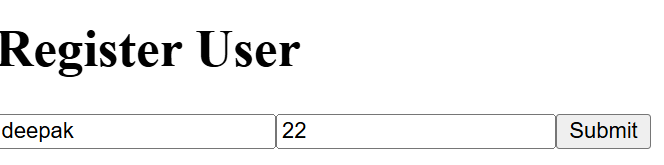
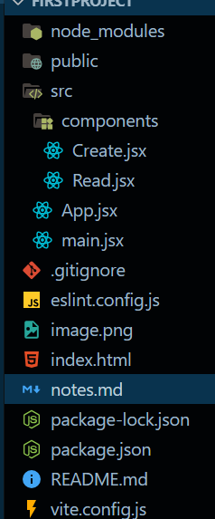
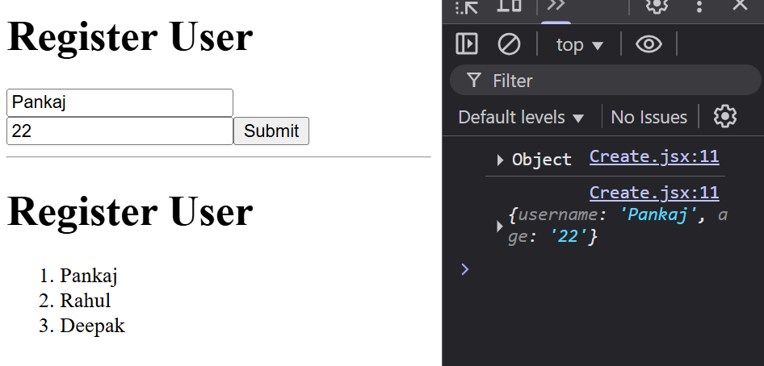
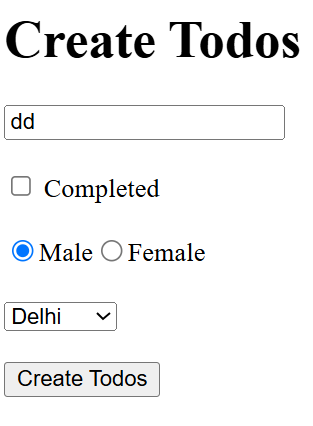

# React notes

##  UseState
Change the name of any user `onClick()` method 
``` js
import React, { useState } from 'react'

const App = () => {
  const [username , setUsername]= useState("Pankaj");
  let changeHandler = () =>{
    setUsername("Amit");
  }
  return (
    <>
    <h1>Username</h1>
    <h2>{username}</h2>
    <button onClick={changeHandler}>Change Username</button>
    </>
  )
}

export default App
```
## Rendering the array of object data (JSON)

``` js
import React from 'react'

const App = () => {
  let profile = [
    {name : "Pankaj" , age : 22},
    {name : "Aman" , age : 21},
    {name : "Rahul", age : 20}
  ];
  let profileUpdate = profile.map((profile,index) =>{
    return <li key={index}>
      <span>Name : {profile.name}</span> <br />
      <small>Age : {profile.age}</small>
    </li>
  })
  return (
    <>
    <h1>Rander Data</h1>
    <ol>{profileUpdate}</ol>
    </>
  )
}

export default App
```
### Output:
``` js
Rander Data

Name : Pankaj
Age : 22
Name : Aman
Age : 21
Name : Rahul
Age : 20
```
## 2-Way Binding (Only use in form)

``` js
import React from 'react'
import { useState } from 'react';

const App = () => {
  const [username, setusername] = useState("")
  const [age, setage] = useState(1)

  // const changeHandler = (e) =>{
  //   setusername(e.target.value)
  // }
  // console.log(username);
  // console.log(age);
  const submitHandler = (e) => {
    e.preventDefault();
    const newUser = { username, age }
    console.log(newUser);  //this data sent to - Api , database , backend
    // console.log("form submit");

  }


  return (
    <>
      <h1>Register User</h1>
      <form onSubmit={submitHandler} >

        <input
          onChange={(e) => setusername(e.target.value)}
          type="text"
          placeholder='Enter username'
          value={username}
        />

        <input
          onChange={(e) => setage(e.target.value)}
          type="number"
          placeholder="Age"
          value={age}
        />

        <button>Submit</button>
      </form>
    </>
  )
}

export default App
```
### Output:


## Props-Drilling
Here shoe in the below multiple file as show , and one setup image for arrenge the files :
- shoe please follow the instruction step by step for understanding the props - drilling

### Setup Image
Always you remember inside the container file should start with capital letter ,

- 

### 1.App.jsx
``` js
import { useState } from 'react'
import Create from './components/Create';
import Read from './components/Read';
const App = () => {
  const [users, setusers] = useState([
    { name: "Pankaj", age: 22 },
    { name: "Rahul", age: 21 },
    { name: "Deepak", age: 23 }
  ]);
  return (
    <>
      <Create/>
      <hr />
      <Read users={users} setusers={setusers}/>
      {/*Read(users , setusers) */}
    </>
  )
}

export default App;
```
### 2.main.jsx
``` js

import { createRoot } from 'react-dom/client'

import App from './App.jsx'

createRoot(document.getElementById('root')).render(<App />)

```
### 3.Cretae a components folder inside the src
- ### 1. Create.jsx
``` js
import { useState } from "react";
const Create = (props) => {
    console.log(props);
    
    const [username, setusername] = useState("");
    const [age, setage] = useState(1);

    const submitHandler = (e) => {
        e.preventDefault();
        const newUser = { username, age };
        console.log(newUser);

    }
    return (
        <div>
            <h1>Register User</h1>
            <form onSubmit={submitHandler}>
                <input
                    onChange={(e) => setusername(e.target.value)}
                    value={username}
                    type="text"
                    placeholder='Username'
                />

                <input
                    onChange={(e) => setage(e.target.value)}
                    value={age}
                    type="number"
                    placeholder='age'
                />
                <button>Submit</button>
            </form>
        </div>
    )
}

export default Create;
```
- ### 2.Read.jsx
``` js
const Read = (props) => {
    console.log(props);
    const users = props.users;
    const setusers = props.setusers;
    
    const renderuser = users.map((user, index) => {
        return <li key={index}>{user.name}</li>
    })
    return (
        <div>
            <h1>Register User</h1>
            <ol>{renderuser}</ol>
        </div>
    )
}

export default Read;
```
### Now final Output is:
- 

## 2-Way Bindind (input text , checked , radio , select) :

``` jsx
import { useState } from "react";
const App = () => {
  const [todos, settodos] = useState([
    { id: 1, title: "Kaam kar le bhai", isCompleted: false }
  ]);
  const [title, settitle] = useState("")
  const [completed, setcompleted] = useState(false);
  const [gender, setgender] = useState("male")
  const [city, setcity] = useState("delhi")

  const submitHandler = (e) => {
    e.preventDefault();
    console.log("form submited");

  }

  return (
    <div>
      <h1>Create Todos</h1>
      <form onSubmit={submitHandler}>
        <input
          onChange={(e) => settitle(e.target.value)}
          value={title}
          type="text"
          placeholder="title" />
        <br /><br />
        <input
          onChange={(e) => setcompleted(e.target.checked)}
          value={completed}
          type="checkbox" /> Completed
        <br /><br />

        <input
          value="male"
          onChange={(e) => setgender(e.target.value)}
          checked={gender == "male" && true}
          type="radio"
        />Male

        <input
          type="radio"
          value="female"
          onChange={(e) => setgender(e.target.value)}
          checked={gender == "female" && true}
        /> Female
        <br /><br />
        <select
          onChange={(e) => setcity(e.target.value)}
          value={city}>
          <option value="delhi">Delhi</option>
          <option value="mumbai">Mumbai</option>
          <option value="kolkata">Kolkata</option>
        </select>
        <br /><br />
        <button>Create Todos</button>
      </form>
    </div>
  )
}

export default App

```
### Final Output :

 - 

